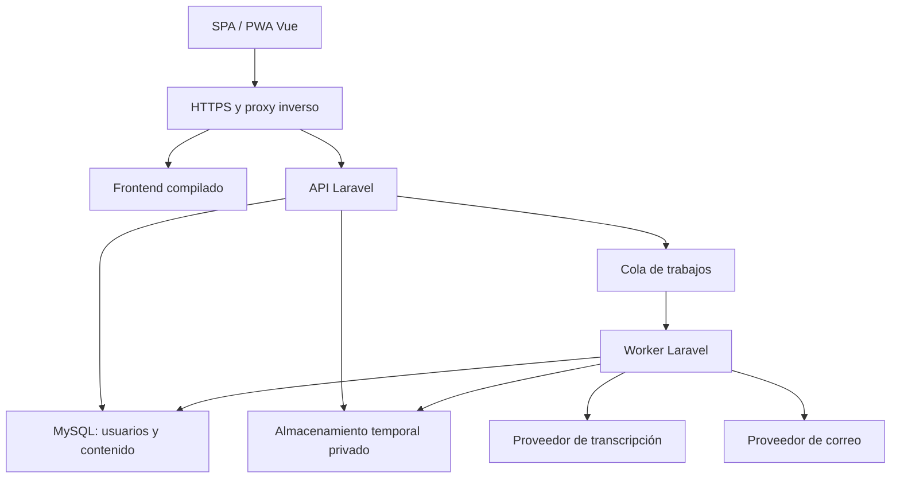

# NoteWave — Plan de producto, arquitectura y calidad

> Ajuste posterior del usuario: la raíz contiene únicamente `frontend/` y `backend/`. La documentación común vive en `backend/docs/`, la infraestructura en `backend/infra/` y las instrucciones en cada proyecto. La estructura propuesta en la sección 6 se conserva como referencia original; este ajuste tiene prioridad. Desarrollo local con MariaDB de XAMPP; MySQL 8.4 sigue pendiente de validación.

Versión: 1.0 · Fecha: 4 de octubre de 2026 · Estado: propuesta para implementación.

## 1. Visión y decisiones principales

NoteWave permitirá organizar notas y actividades privadas, escribir sus descripciones o dictarlas mediante el micrófono y marcar las actividades completadas. Cada persona tendrá una cuenta y accederá exclusivamente a su información.

La propuesta es una aplicación web responsiva e instalable como PWA, con frontend Vue 3 y TypeScript, API REST Laravel y base de datos MySQL. Frontend y backend estarán separados en el código, pero se publicarán bajo un mismo origen para simplificar sesiones, seguridad y operaciones. Laravel será un monolito modular: una aplicación backend organizada por responsabilidades, sin introducir microservicios inicialmente.

La transcripción se realizará mediante un proveedor externo invocado desde Laravel. El usuario revisará el resultado antes de incorporarlo a su descripción. No se requiere Python para este enfoque; sería una alternativa posterior si se decide operar un motor de transcripción propio.

### Supuestos de planificación

- Proyecto inicialmente desarrollado por una persona o un equipo pequeño.
- Servicio para usuarios individuales, sin colaboración ni organizaciones en la primera versión.
- Primer mercado previsto: México; interfaz inicial en español.
- Dictado principalmente en español, con inglés como idioma adicional.
- Notas y actividades contienen texto privado; el audio no será un archivo permanente.
- No hay presupuesto ni volumen de usuarios confirmados. Los límites y objetivos siguientes son propuestas, no capacidades ya demostradas.

## 2. Tipo de software y alcance

Es software de productividad personal, multiusuario, con arquitectura cliente-servidor. Su frontend será una SPA y su distribución web una PWA. Si se ofrece como servicio alojado para múltiples cuentas, podrá operar como SaaS aunque inicialmente sea gratuito. Una PWA no equivale a una aplicación nativa ni garantiza dictado o sincronización sin conexión.

### MVP: primera versión utilizable

| Área | Funcionalidades |
| --- | --- |
| Cuenta | Registro, verificación de correo, inicio y cierre de sesión, recuperación de contraseña, cambio de contraseña |
| Contenido | Crear, listar, buscar, editar y eliminar notas y actividades |
| Actividades | Marcar completada o pendiente, filtrar por estado |
| Descripción | Texto editable, grabación de voz, transcripción y revisión del resultado |
| Perfil | Nombre, idioma de dictado, zona horaria, exportación y eliminación de cuenta |
| Experiencia | Diseño móvil y escritorio, estados de carga/error/vacío, navegación por teclado |
| Operación | Correos transaccionales, respaldos, monitoreo, límites de consumo |

### Diferencia entre nota y actividad

Una nota conserva información y no tiene estado de finalización. Una actividad representa algo por hacer y puede estar pendiente o completada. Ambas compartirán título y descripción. En el MVP se distinguirán por un campo `kind`, con reglas backend explícitas para cada tipo.

### Evolución posterior

Etiquetas, carpetas, prioridades, fechas límite, recordatorios, notas fijadas, MFA, passkeys, colaboración, aplicaciones nativas y sincronización offline. El dictado en tiempo real y las funciones de IA para resumir o crear actividades son desarrollos independientes y no forman parte del MVP.

## 3. Selección tecnológica

| Capa | Elección | Motivo y condición |
| --- | --- | --- |
| Frontend | Vue 3, Composition API y TypeScript estricto | Componentes claros y lógica extraíble a composables; adecuado para formularios y listas |
| Compilación | Vite | Generación de archivos estáticos para producción |
| Navegación | Vue Router | Rutas públicas y privadas; el backend sigue siendo responsable de autorizar |
| Estado | Pinia | Sesión y estado compartido; mantener los estados de formulario locales |
| Cliente HTTP | Axios, una instancia central | Cookies, CSRF, cancelación y manejo uniforme de errores |
| Estilos | CSS con variables de diseño y archivos por componente | Separar presentación de lógica; evitar estilos en línea y reglas globales accidentales |
| Iconos | Una biblioteca SVG consistente, por ejemplo Lucide | Etiquetas accesibles; evitar depender de emojis para acciones |
| Backend | Laravel, PHP compatible con la versión elegida | Validación, autorización, colas, correo y convenciones conocidas |
| Autenticación | Laravel Fortify + Sanctum | Fortify para flujos de cuenta; Sanctum para sesión de la SPA |
| Base de datos | MySQL, InnoDB y utf8mb4 | Modelo relacional sencillo, transacciones e índices por propietario |
| Colas y sesiones MVP | Drivers de base de datos de Laravel | Menos servicios iniciales; requieren un worker supervisado |
| Escalado | Redis, cuando haya necesidad medida | Colas, caché y coordinación entre múltiples instancias |
| Audio | getUserMedia + MediaRecorder | Grabación desde el navegador con permiso explícito |
| Transcripción | API externa detrás de `SpeechToTextProvider` | Cambiar proveedor sin modificar las vistas ni el dominio |
| Correo | Proveedor transaccional vía API o SMTP | Verificación y recuperación con seguimiento de entrega |
| Pruebas | PHPUnit o Pest, Vitest, Vue Test Utils y Playwright | Backend, componentes y recorridos de usuario |
| Calidad estática | PHPStan/Larastan, Pint, ESLint y Prettier | Tipos, errores previsibles y formato consistente |

Elegir versiones estables con soporte vigente al iniciar el desarrollo y registrar la matriz PHP/Laravel/Node/MySQL. No adoptar automáticamente una versión mayor recién publicada. Fijar dependencias mediante `composer.lock` y el lockfile de npm y comprobarlas en CI.

Vue encaja con la separación solicitada: template, script y CSS pueden estar en archivos distintos. React también es válido, aunque JSX combina marcado y expresiones; Angular aporta convenciones fuertes con mayor estructura inicial. Laravel resulta suficiente para la lógica y la integración con voz; NestJS o FastAPI serían alternativas si existiera un requisito concreto de equipo o procesamiento propio.

## 4. UX/UI

### Estructura de navegación

- Área pública: bienvenida, registro, login, recuperación y restablecimiento de contraseña.
- Área privada: Todas, Notas, Actividades pendientes, Completadas y Cuenta.
- Escritorio: navegación lateral, buscador y lista principal con editor de detalle.
- Móvil: lista de una columna, navegación compacta y editor a pantalla completa.

La pantalla principal priorizará filas de contenido: checkbox para actividades, título, vista previa y acciones secundarias. Crear contenido será la acción principal. No se requiere un tablero de tarjetas para organizar una lista sencilla.

### Lenguaje visual

Identidad tranquila con base clara, acentos azul o turquesa y una referencia sutil a ondas de sonido. El efecto de cristal puede usarse en la navegación o el panel de grabación, con superficies opacas como respaldo. El texto y los formularios deben conservar contraste aun sin transparencias. Tema oscuro opcional después de consolidar el sistema de diseño.

Definir tokens de color, espaciado, tipografía, radios, sombras, capas y movimiento. Mantener iconografía consistente, animaciones breves y respeto por `prefers-reduced-motion`.

### Editor y dictado

1. El usuario abre una nota o actividad y edita título y descripción.
2. Pulsa “Dictar”; se explica que el audio se enviará al servicio de transcripción.
3. Se solicita micrófono únicamente al iniciar la grabación.
4. Se muestra estado visible, contador, detener y cancelar.
5. Al detener, se muestra “Transcribiendo” sin bloquear el resto de la aplicación.
6. El texto aparece en una vista previa editable.
7. El usuario elige insertar o reemplazar. Reemplazar una descripción existente requiere confirmación.
8. Guardar persiste el contenido; recibir una transcripción nunca lo guarda automáticamente.

Estados: disponible, solicitando permiso, grabando, detenido, enviando, en cola, procesando, listo, fallido y cancelado. Manejar permiso denegado, micrófono inexistente, audio vacío, silencio, desconexión, límite excedido y proveedor indisponible. La escritura manual siempre estará disponible.

### Accesibilidad y usabilidad

Objetivo: WCAG 2.2 nivel AA, con comprobación automática y manual. Etiquetas reales, foco visible, navegación por teclado, errores asociados al campo, anuncios de estados mediante regiones accesibles y controles táctiles cómodos. El checkbox no dependerá del color para comunicar finalización. Probar zoom, lectores de pantalla y contraste.

Guardar será explícito en el MVP; avisar antes de salir de un formulario con cambios. Las acciones optimistas, como completar una actividad, deben revertirse y comunicar el error si el servidor falla. Una prueba breve con usuarios debe validar que puedan crear, completar y dictar sin instrucciones externas.

## 5. Arquitectura lógica



### Módulos backend

| Módulo | Responsabilidad |
| --- | --- |
| Identity | Cuenta, sesión, verificación, recuperación y cierre de sesiones |
| Entries | Notas, actividades, filtros y reglas de finalización |
| Transcription | Carga, cuota, jobs, proveedor, estados y limpieza |
| Privacy | Exportación, eliminación, registro de preferencias |
| Operations | Salud, métricas, eventos técnicos y gestión de fallos |

Flujo de una petición: ruta y middleware → Form Request → Policy → Action → modelo/Eloquent → API Resource. Los controladores coordinan y no contienen la lógica de negocio. Las Actions representan operaciones concretas; no crear capas de repositorios que únicamente repitan métodos de Eloquent.

## 6. Organización del repositorio

Monorepo con dos aplicaciones y documentación común. Esto permite revisar cambios del contrato API junto con sus consumidores.

```text
notewave/
  frontend/
    src/
      app/                 # Bootstrap, router, configuración e instancia HTTP
      layouts/             # Estructura pública y privada
      pages/               # Vistas finas que ensamblan componentes
      components/ui/       # Botones, inputs, diálogos y estados compartidos
      features/
        auth/              # components, composables, services, types, styles
        entries/           # components, composables, services, types, styles
        transcription/     # Grabador, estados y cliente de transcripción
        account/           # Perfil y privacidad
      stores/              # Estado global realmente compartido
      styles/              # Tokens, reset y estilos generales
      assets/              # SVG, fuentes y recursos estáticos
    tests/
  backend/
    app/
      Actions/             # Operaciones por módulo
      Contracts/           # SpeechToTextProvider, por ejemplo
      Http/Controllers/    # Controladores por módulo
      Http/Requests/       # Validación y normalización
      Http/Resources/      # Contrato de respuesta
      Jobs/                # Transcripción, exportación, borrado
      Models/
      Policies/
      Services/            # Adaptadores de proveedores
    database/migrations/
    routes/
    tests/                 # Unit, Feature e Integration
  docs/
    architecture.md
    openapi.yaml
    security.md
    privacy.md
    runbooks/
    adr/                   # Decisiones y motivos
  infra/                   # Configuración de despliegue y desarrollo
  scripts/                 # Automatización ejecutable documentada
  .github/workflows/
  README.md
```

### Convenciones obligatorias

- Una vista compone elementos y conecta eventos; no realiza llamadas HTTP ni implementa la grabación directamente.
- Separación literal cuando corresponda: `EntryEditor.vue`, `EntryEditor.ts` y `EntryEditor.css`, enlazados mediante `script src` y `style scoped src`. Usar exportación `defineComponent`/`setup` compatible con scripts externos; no asumir que `script setup` admite `src`.
- Extraer reutilización a `useEntryEditor.ts` y `useAudioRecorder.ts`; no crear archivos vacíos por cumplir una estructura.
- Una instancia HTTP; servicios por funcionalidad y tipos de DTO explícitos.
- Nada de consultas, validaciones comerciales ni autorizaciones en templates.
- Evitar variables globales, scripts sueltos y CSS inline salvo valores dinámicos justificados.
- Componentes con responsabilidad clara y APIs de props/eventos tipadas; dividir por responsabilidad, no por un número arbitrario de líneas.
- Nombres de código consistentes en inglés y textos de interfaz centralizados para traducción.
- Fechas de servidor en UTC y formato ISO 8601; presentación en la zona del usuario.
- Documentar configuración con `.env.example` sin secretos y ADR para decisiones relevantes.

## 7. Modelo de datos

| Tabla | Campos principales | Reglas |
| --- | --- | --- |
| users | id, name, email, password, email_verified_at, locale, timezone, timestamps | Email normalizado y único; password contiene hash |
| entries | id, user_id, kind, title, description, completed_at, version, timestamps | kind: note/task; notas siempre con completed_at null |
| transcription_jobs | id, user_id, status, language, private_audio_path, transcript, error_code, duration_seconds, expires_at, idempotency_key, timestamps | Propietario obligatorio; contenido temporal; no acceso público |
| usage_counters | user_id, period_start, reserved_seconds, consumed_seconds | Restricción única por usuario y periodo; actualización atómica |
| privacy_events | id, user_id, event_type, policy_version, created_at | Evidencia mínima de decisiones de privacidad, sin contenido de notas |
| sessions | Campos estándar Laravel | Driver database; posibilidad de revocar sesiones |
| password_reset_tokens | Campos estándar Laravel | Token protegido, caducidad y un solo uso |
| jobs / failed_jobs | Campos estándar Laravel | Colas y fallos técnicos; evitar audio/texto en payloads |

`entries` tendrá índices `(user_id, updated_at, id)` y `(user_id, kind, completed_at, id)`. Paginación estable con límite máximo. Búsqueda siempre filtrada por usuario; comenzar con búsqueda sencilla acotada y evaluar FULLTEXT con datos reales si se degrada.

Las relaciones usarán claves foráneas. El borrado de cuenta eliminará contenido y coordinará la limpieza de archivos y jobs; una cascada SQL no borra archivos externos. No incluir papelera en el MVP para evitar ambigüedad sobre la eliminación.

`version` permite concurrencia optimista: actualizar sólo cuando coincida la versión enviada y devolver 409 si otra pestaña modificó el contenido. Los identificadores pueden ser ULID para facilitar generación y orden; conocer o cambiar un identificador nunca concede acceso.

## 8. Contrato API

Fortify conserva sus rutas de autenticación de sesión; el dominio de contenido utiliza `/api/v1`. Especificar todos los contratos en OpenAPI y mantener pruebas de respuesta.

| Método y ruta | Uso |
| --- | --- |
| GET /sanctum/csrf-cookie | Inicializar protección CSRF |
| POST /register | Registro |
| POST /login | Iniciar sesión |
| POST /logout | Cerrar sesión |
| POST /forgot-password | Solicitar recuperación, respuesta genérica |
| POST /reset-password | Restablecer contraseña |
| POST /email/verification-notification | Reenviar verificación con límites |
| GET /email/verify/{id}/{hash} | Verificación con URL firmada y expiración |
| GET /api/v1/me | Usuario actual |
| PATCH /api/v1/me | Perfil; cambio de email exige nueva verificación |
| GET /api/v1/entries | Lista por tipo, estado y búsqueda con paginación |
| POST /api/v1/entries | Crear nota o actividad |
| GET /api/v1/entries/{id} | Detalle privado |
| PATCH /api/v1/entries/{id} | Editar con control de versión |
| PATCH /api/v1/entries/{id}/completion | Establecer completed true/false para una actividad |
| DELETE /api/v1/entries/{id} | Eliminar contenido |
| POST /api/v1/transcriptions | Cargar audio y crear trabajo; responde 202 |
| GET /api/v1/transcriptions/{id} | Consultar estado y resultado propios |
| DELETE /api/v1/transcriptions/{id} | Solicitar cancelación y limpieza |
| POST /api/v1/account/export | Solicitar exportación privada |
| DELETE /api/v1/account | Borrar cuenta tras reautenticación |

Finalizar es una operación de asignación de estado, no un toggle: repetir `completed: true` no debe desmarcar la actividad. En uploads usar `Idempotency-Key` único por usuario para que reintentos no creen varios trabajos.

Códigos previstos: 401 sesión requerida, 403 acción no autorizada o correo sin verificar, 404 recurso inexistente o de otro propietario, 409 conflicto de edición, 413 carga excesiva, 422 validación y 429 cuota/límite. Los errores no incluyen excepciones internas. No permitir asignación masiva de `user_id`, cuotas o estado de jobs desde el cliente.

## 9. Voz y transcripción

### Flujo técnico

- Comprobar disponibilidad de APIs y pedir `audio: true` únicamente tras la acción del usuario. El acceso a micrófono requiere contexto seguro, normalmente HTTPS.
- Seleccionar MIME mediante `MediaRecorder.isTypeSupported`; probar los formatos reales producidos por Safari/iOS y Chromium. No forzar WebM como formato universal.
- Grabar con límite visible; liberar todas las pistas al detener, cancelar o desmontar el componente. Revocar object URLs y limpiar buffers.
- Enviar multipart con sesión y CSRF a Laravel. El servidor valida propietario, tamaño, contenido real y duración, sin confiar sólo en MIME/extensión proporcionados.
- Reservar cuota de forma atómica antes del procesamiento; almacenar fuera de `public/` con nombre aleatorio y crear el job.
- El worker invoca `SpeechToTextProvider`, guarda temporalmente el resultado y elimina audio al terminar. Usar nombres de archivo generados y argumentos seguros si se requiere FFmpeg/ffprobe.
- El frontend consulta estado con polling limitado, backoff y parada al finalizar o abandonar la pantalla. No es necesario WebSocket para el MVP.
- El usuario revisa y guarda el texto en `entries.description`; ese guardado es independiente del trabajo de voz.

### Límites propuestos

| Control | Valor inicial propuesto |
| --- | --- |
| Audio por grabación | 120 segundos y 10 MiB, lo que ocurra primero |
| Concurrencia | Un trabajo activo por usuario |
| Cuota diaria | 20 minutos por usuario verificado; ajustable por presupuesto |
| Reintentos worker | Máximo 2 ante fallos transitorios; no ante audio inválido |
| Timeout proveedor | 60 segundos por intento; job y visibility timeout deben ser mayores |
| Audio temporal | Borrar al finalizar; limpieza de huérfanos antes de 24 horas |
| Transcripción temporal | Hasta 24 horas; eliminar tras inserción confirmada o expiración |

El límite efectivo siempre será el menor entre NoteWave, proxy, PHP y proveedor. Si el proveedor no admite un formato del navegador, convertir en worker a un formato admitido, con tiempo y recursos acotados. Los límites de cliente sirven a UX; los del servidor son obligatorios.

La cancelación local no garantiza detener una petición externa ya enviada. Marcar el job cancelado, descartar su resultado, limpiar archivos y reflejar cualquier consumo realmente facturado. Ante borrado de cuenta, comprobar que el propietario siga activo antes y después de la llamada.

### Proveedor y costos

La API de transcripción de OpenAI es una candidata, no una dependencia irrevocable. Validar formatos, idiomas, latencia, precisión, tarifas y tratamiento de datos antes de contratar. La clave permanece en backend. El adaptador expone `transcribe(audio, language)` y errores normalizados, sin mezclar el formato del proveedor con la API pública de NoteWave.

Comparar precisión con un corpus consentido de dictados en español e inglés, ruido, acentos y pausas. Mostrar una transcripción editable: ningún motor asegura fidelidad absoluta. No usar la Web Speech API como único mecanismo, por su dependencia del navegador y del servicio que éste utilice.

Presupuesto mensual = infraestructura + base de datos + correo + minutos de transcripción × tarifa vigente + almacenamiento/backups + monitoreo. Configurar cuotas, alertas y un interruptor de dictado que conserve la escritura manual. Reintentos externos pueden generar consumo duplicado; registrarlo sin prometer facturación exactamente una vez.

## 10. Autenticación y seguridad

### Sesiones

Para la SPA propia usar Sanctum con cookies de sesión, como recomienda su documentación, y Fortify para cuenta/recuperación. Publicar frontend y API en el mismo origen; `/api`, rutas de cuenta y `/sanctum` irán al backend antes del fallback de la SPA.

Cookie de sesión `HttpOnly`, `Secure` y `SameSite` apropiado; HTTPS obligatorio y CSRF en operaciones con sesión. La cookie `XSRF-TOKEN` debe ser legible por el cliente para el mecanismo CSRF, pero no es la credencial de sesión. No guardar tokens de autenticación en localStorage. Si posteriormente existe una app nativa, evaluar tokens revocables de Sanctum y almacenamiento seguro del sistema operativo.

Regenerar sesión al autenticar, invalidarla al salir y revocar otras sesiones tras recuperación de contraseña. Caducidad propuesta: 2 horas de inactividad, ajustable tras pruebas. Permitir contraseñas largas y gestores; utilizar hashing estándar de Laravel y parámetros medidos. Aplicar reautenticación a cambios sensibles, exportación y eliminación.

### Amenazas y controles

| Riesgo | Control y evidencia requerida |
| --- | --- |
| Acceso a notas ajenas | Consultas acotadas por usuario y Policies; pruebas cruzadas en todos los endpoints |
| Cambiar datos desde F12 | Validar y autorizar en servidor; no confiar en campos ocultos ni rutas privadas frontend |
| XSS | Descripciones como texto escapado; evitar `v-html`; sanitizar si luego hay Markdown |
| CSRF | Middleware de sesión/CSRF y pruebas de solicitudes sin token |
| Inyección SQL | Eloquent/parametrización; allowlist para campos de ordenamiento |
| Robo de cuenta | Límites por cuenta/IP, mensajes genéricos, verificación y rotación de sesiones |
| Abuso de dictado | Cuotas atómicas, tamaño/duración, concurrencia y presupuesto global |
| Archivo malicioso | Inspección del contenido, parsers mantenidos, procesamiento limitado y almacenamiento privado |
| Fuga de secretos | Secret scanning, `.env` fuera de Git, secretos por entorno y rotación |
| Fuga por logs/caché | Redactar payloads y credenciales; `Cache-Control: no-store` en información privada |
| Dependencia comprometida | Lockfiles, auditoría de dependencias y actualizaciones revisadas |

Fortalecer con CSP compatible con el build, HSTS tras comprobar HTTPS, `nosniff`, protección frente a iframes y `Permissions-Policy: microphone=(self)`. CORS permanecerá desactivado o restringido a orígenes explícitos si existe una necesidad real. CORS no sustituye autorización.

No publicar `.env`, repositorio, backups, archivos temporales ni directorios de Laravel distintos de `public`. El frontend necesariamente es visible desde el navegador; debe contener sólo configuración pública. Minificar no protege secretos.

Usar OWASP ASVS como catálogo versionado de controles y evidencias. No afirmar certificación ni seguridad total por usar un framework o pasar un escáner. No ofrecer cifrado de extremo a extremo: el servidor y el proveedor necesitan procesar el contenido bajo esta arquitectura.

## 11. Privacidad y cumplimiento

Si NoteWave opera en México como servicio de un particular, evaluar la LFPDPPP vigente y su aplicabilidad concreta antes del lanzamiento. Esta sección organiza trabajo de cumplimiento; no constituye una certificación jurídica.

- Inventario: correo, nombre, hash de contraseña, notas, audio temporal, transcripción, metadatos de uso y eventos de seguridad.
- Minimización: no solicitar teléfono, ubicación, identificación ni voz para identificación biométrica.
- Aviso de privacidad: responsable, finalidades, contacto, conservación, encargados/proveedores, transferencias aplicables y mecanismo de derechos ARCO.
- Antes del dictado informar que existe procesamiento externo. El permiso técnico del navegador no equivale por sí solo a consentimiento informado para todas las finalidades.
- Revisar contrato del proveedor, retención, región de procesamiento, subencargados y condiciones de entrenamiento. No asumir que borrar el archivo en NoteWave elimina copias del proveedor.
- Ofrecer exportación, corrección y eliminación; mantener sólo la evidencia mínima necesaria.
- Propuesta de retención: audios/resultados según sección 9; logs técnicos redactados 30 días; backups con rotación 30 días. Confirmar plazos con necesidades reales y obligaciones aplicables.
- La eliminación debe informar que los datos pueden permanecer temporalmente en backups aislados hasta su expiración. Al restaurar, reaplicar solicitudes de borrado pendientes.
- No usar contenido privado para analítica o entrenamiento sin una finalidad y autorización específicas. Analítica de uso sólo con eventos mínimos, sin texto ni audio.
- Si se dirige a menores o a otros países, revisar requisitos adicionales antes de ampliar el público.
- Mantener registro de licencias de código, iconos y fuentes; procedimientos para incidentes y solicitudes de privacidad.

La política del proveedor de transcripción se revisa por producto y endpoint: las condiciones de ChatGPT no deben trasladarse automáticamente a una API.

## 12. Calidad y validación

### Objetivos iniciales medibles

| Dimensión | Objetivo propuesto | Cómo verificar |
| --- | --- | --- |
| Aislamiento | Ningún acceso cruzado de datos | Matriz usuario A/B para leer, editar, borrar, listar y transcribir |
| Rendimiento | API CRUD p95 menor de 500 ms | Prueba en staging con dataset de 10 000 entradas por cuenta y 50 sesiones activas |
| Experiencia | LCP ≤ 2.5 s, INP ≤ 200 ms, CLS ≤ 0.1 | Mediciones en dispositivo móvil; percentil 75 cuando haya datos reales |
| Disponibilidad | SLO mensual propuesto 99.5% | Checks externos y definición documentada de incidentes |
| Recuperación | RPO ≤ 24 h; RTO ≤ 4 h | Restauración completa medida; mejorar con backups/logs más frecuentes si hace falta |
| Accesibilidad | Objetivo WCAG 2.2 AA | Automatización más teclado, lector de pantalla y revisión manual |
| Transcripción | Medir latencia, fallos y precisión del corpus | Comparativa de proveedores; objetivo definitivo tras prototipo |

La latencia de voz se medirá aparte del CRUD y desde carga hasta resultado, incluyendo espera en cola. Los objetivos son criterios de diseño pendientes de validación, no un SLA ofrecido comercialmente.

### Pruebas por nivel

- Unitarias: reglas note/task, finalización, control de versión, cuotas y transiciones de jobs.
- Backend de integración: registro, recuperación, sesiones reales, CSRF, ownership, paginación, validación y borrado.
- Concurrencia con MySQL: reservas de cuota, idempotencia y edición; SQLite no reproduce todos sus bloqueos ni restricciones.
- Frontend: estados del editor, errores, accesibilidad de controles y liberación del micrófono.
- E2E: registrar/verificar, login, crear, completar, editar, recuperar contraseña y cerrar sesión.
- Audio: mocks para estados más pruebas reales en Safari iOS, Chrome Android y navegadores desktop acordados.
- Proveedor: adaptador simulado en CI y pruebas reales controladas en staging, evitando datos personales reales.
- Seguridad: acceso cruzado, XSS almacenado, uploads excesivos, rate limits y ausencia de secretos en bundles/logs.
- Operación: reinicio de worker, timeout, caída del proveedor, llenado de disco, limpieza y restauración.

### Definición de terminado

Una funcionalidad tiene criterios de aceptación, permisos y errores definidos; código organizado; contrato actualizado; pruebas relevantes aprobadas; revisión de accesibilidad y privacidad; métricas cuando corresponde; y documentación de cualquier configuración o migración necesaria. Un porcentaje de cobertura por sí solo no demuestra calidad.

## 13. PWA y uso sin conexión

En el MVP, el service worker almacena únicamente el shell y recursos estáticos versionados. No cachea respuestas de sesión, notas, transcripciones ni URLs de exportación. No habrá persistencia automática de contenido privado en localStorage, IndexedDB o Cache Storage.

Sin conexión se informa el estado y no se promete guardar o dictar. Los cambios no enviados permanecen en memoria mientras la pantalla siga abierta. Comunicar esta limitación y avisar antes de cerrar. Al salir, limpiar stores, buffers y cualquier dato temporal del usuario anterior.

La sincronización offline futura requerirá un diseño específico: almacenamiento local, exposición en dispositivos compartidos, colas de cambios, conflictos, borrado y separación de cuentas. Cifrar con una clave guardada junto a los datos no resuelve por sí solo esa amenaza.

## 14. Despliegue e infraestructura

### Entorno recomendado

VPS o plataforma administrada que soporte PHP, jobs supervisados y tareas programadas. Inicialmente un despliegue con proxy Nginx/Caddy, PHP-FPM, worker Laravel, scheduler, MySQL y almacenamiento privado. Base de datos accesible sólo desde la aplicación; correo y transcripción externos. Docker Compose es útil para reproducibilidad local y staging, sin ser obligatorio para producción.

Un hosting compartido puede funcionar para Laravel, pero sólo elegirlo después de comprobar: PHP compatible, extensiones, Composer o build precompilado, document root en `public`, cron, jobs prolongados, límites de carga, almacenamiento privado y salida HTTPS al proveedor. Para voz asíncrona, la ausencia de worker persistente complica el diseño. No asumir que cualquier plan de IONOS o Hostinger cumple estas condiciones.

### Entornos

| Entorno | Reglas |
| --- | --- |
| Desarrollo | Datos ficticios, correo capturado localmente y proveedor simulado por defecto |
| Staging | Configuración similar a producción, dominio propio, secretos y cuentas separados |
| Producción | Debug desactivado, HTTPS, backups, monitoreo y acceso restringido |

Compilar Vue en CI y publicar los estáticos; no ejecutar el servidor de Vite en producción. Ajustar proxy y PHP para los límites acordados, comprimir estáticos y usar cache prolongada sólo en assets con hash. El HTML y el service worker deben actualizarse oportunamente.

### Pipeline

1. Revisar pull request, tipos, formato, pruebas y dependencias.
2. Compilar frontend e instalar dependencias PHP reproduciblemente.
3. Buscar secretos y generar un artefacto identificado por commit.
4. Publicar en staging; verificar login, CRUD, voz y correo.
5. Respaldar y aplicar migraciones compatibles antes de activar la nueva versión.
6. Desplegar release atómico, limpiar/regenerar caches apropiadas y reiniciar workers.
7. Verificar salud, errores y recorrido mínimo; revertir el artefacto si falla.

No ejecutar migraciones destructivas sin plan de datos. Usar estrategia expandir/migrar/retirar para cambios incompatibles; volver al código anterior no revierte automáticamente una base de datos. Documentar el procedimiento y validar compatibilidad de API entre frontend nuevo y anterior.

## 15. Operaciones y mantenimiento

- Logs JSON con request ID, códigos de error y tiempos; nunca descripciones, audio, passwords, cookies o claves.
- Métricas: latencia/error API, profundidad/antigüedad de cola, transcripciones fallidas, minutos consumidos, cuota, disco y correo rechazado.
- `/health/live` básico y readiness restringido con dependencias críticas; no exponer detalles de infraestructura. Si falla voz, el CRUD debe seguir disponible.
- Alertas para caída, aumento sostenido de errores, worker detenido, backup fallido, disco y gasto previsto excesivo.
- Backups cifrados, separados del servidor y con credenciales de mínimo privilegio. Restauración de prueba mensual durante el lanzamiento y después con frecuencia documentada.
- Scheduler para limpiar audio/resultados vencidos, purgar jobs sensibles y controlar expiraciones; verificar que se ejecute.
- Revisar parches periódicamente y urgencias de seguridad según severidad; registrar versiones, cambios y fecha de revisión.
- Runbooks para caída de transcripción, fallos de correo, recuperación de DB, filtración de clave y solicitudes de eliminación.
- Exportaciones privadas con caducidad y descarga autenticada; no adjuntar toda la información a correos.

Escalar a partir de mediciones: optimizar índices/paginación primero, separar workers después, introducir Redis y almacenamiento privado compartido al usar varias instancias. Coordinar sesiones, cuotas y locks de forma centralizada. No introducir Kubernetes o microservicios por anticipación.

## 16. Hoja de ruta y entregables

| Fase | Resultado | Criterio de salida |
| --- | --- | --- |
| 0. Definición | Backlog, wireframes, modelo de amenazas, ADR y matriz de versiones | Alcance y decisiones pendientes registrados |
| 1. Base | Repositorio, diseño, API, MySQL, CI y staging | Build reproducible y despliegue mínimo |
| 2. Identidad | Registro, verificación, sesión y recuperación | Flujos completos con correo y pruebas de aislamiento |
| 3. Contenido | Notas, actividades, búsqueda y editor | CRUD funcional, control de versión y UX validada |
| 4. Voz | Prototipo de formatos, adaptador, jobs, cuotas y UI | Dictado real probado en iPhone y Android; fallos recuperables |
| 5. Calidad | Accesibilidad, seguridad, privacidad y carga | Evidencias y defectos críticos resueltos |
| 6. Lanzamiento | Backups, monitoreo, runbooks y release | Restauración ensayada y recorrido de producción aprobado |

Antes de programar voz completa conviene un prototipo corto: grabar en iPhone/Android, validar archivos, transcribir y medir costo/latencia. Esta prueba resuelve el mayor riesgo técnico de la propuesta.

### Decisiones pendientes

1. Presupuesto mensual y cantidad esperada de usuarios.
2. Proveedor/modelo de transcripción, región y contrato de datos.
3. Hosting con capacidad real para workers y procesamiento de audio.
4. Límites finales, política de conservación y disponibilidad ofrecida.
5. Identidad visual y validación del editor con usuarios.

Mientras se resuelven, el MVP se puede construir con proveedor simulado y la arquitectura aquí descrita. No es necesario añadir prioridades, recordatorios o colaboración para entregar la idea inicial.

## 17. Criterios de aceptación clave

- Dos usuarios no pueden consultar ni modificar datos del otro, incluso alterando peticiones desde F12.
- Una actividad se completa y vuelve a pendiente; una nota no admite finalización.
- Recuperación usa un enlace con expiración y un solo uso; no revela si una dirección está registrada.
- El audio sólo comienza tras la acción del usuario y el micrófono se libera al terminar.
- El dictado no sobrescribe ni guarda automáticamente una descripción existente.
- Fallar transcripción no impide escribir o guardar manualmente.
- Un reintento de carga con la misma clave no duplica el job.
- Los límites funcionan bajo solicitudes concurrentes y no sólo en la UI.
- El audio se elimina y la limpieza de huérfanos tiene evidencia operativa.
- Cerrar sesión no deja contenido privado disponible por caché o estado de la cuenta anterior.
- El proyecto se instala con pasos documentados y producción se restaura desde un backup probado.

## 18. Fuentes técnicas y normativas

Consultadas para fundamentar la propuesta; verificar nuevamente versiones, precios, condiciones y ley aplicable antes de implementar o lanzar. Las decisiones arquitectónicas y límites de este documento son recomendaciones de diseño.

1. [Laravel Sanctum: autenticación SPA](https://laravel.com/framework/docs/12.x/sanctum). Fundamenta cookies de sesión y CSRF; la versión de implementación se decide al iniciar.
2. [Vue: gestión de estado](https://vuejs.org/guide/scaling-up/state-management.html). Referencia para Pinia y estado compartido.
3. [MDN: getUserMedia](https://developer.mozilla.org/en-US/docs/Web/API/MediaDevices/getUserMedia) y [MediaRecorder](https://developer.mozilla.org/en-US/docs/Web/API/MediaRecorder). Permiso, contexto seguro y captura.
4. [OpenAI: transcripción de archivos](https://developers.openai.com/api/docs/guides/speech-to-text) y [controles de datos API](https://developers.openai.com/api/docs/guides/your-data). Evaluar restricciones y política específica del endpoint.
5. [W3C: WCAG 2.2](https://www.w3.org/TR/WCAG22/). Objetivo de accesibilidad.
6. [OWASP: ASVS](https://owasp.org/projects/asvs). Base de verificación técnica de seguridad.
7. [Cámara de Diputados: LFPDPPP, texto vigente](https://www.diputados.gob.mx/LeyesBiblio/pdf/LFPDPPP.pdf). Referencia para evaluar protección de datos en México.
